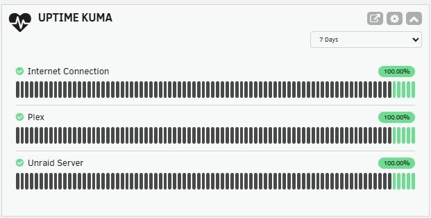

# Uptime Kuma Dashboard Widget for Unraid

An Unraid plugin that displays your [Uptime Kuma](https://github.com/louislam/uptime-kuma) monitor statuses directly on the Unraid dashboard with heartbeat bars, uptime percentages, and configurable time periods.

> **Note:** This plugin requires Uptime Kuma to be running as a Docker container on the same Unraid server. It reads the SQLite database directly from the filesystem. Remote Uptime Kuma instances are not supported.



## Features

- Heartbeat bars matching Uptime Kuma's style (green/red/orange/blue) with hover tooltips showing date/time and status
- Uptime percentage badges with color coding
- Configurable time periods (1 hour, 12 hours, 24 hours, 7 days, 30 days, 90 days, 180 days)
- Quick link to Uptime Kuma WebUI (auto-detected from Docker template or set manually)
- Choose which monitors to display via checkbox list in settings
- Native Unraid dashboard tile with settings cog, collapse, and external link controls
- Reads directly from Uptime Kuma's SQLite database — no API keys or background services needed
- Supports both **Uptime Kuma v1.x** and **v2.x** (auto-detected)
- Down monitors sorted to top

## Compatibility

| Uptime Kuma Version | Support |
|---------------------|---------|
| v1.x (1.23.x) | Full support — all periods read from heartbeat table |
| v2.x (2.2.x+) | Full support — short periods use heartbeat, longer periods use stat_hourly/stat_daily aggregate tables |

Version is auto-detected from the database. No configuration needed.

## Prerequisites

- **Unraid 6.11.0 or later**
- **Uptime Kuma** running as a Docker container **on the same Unraid server** (remote instances are not supported)
- The Uptime Kuma Docker container must have its data directory volume-mapped to the Unraid filesystem (this is the default when installed via Community Applications)

## Installation

### Via Unraid Plugin Manager (Recommended)

1. In the Unraid WebGUI, go to the **Plugins** tab
2. Click the **Install Plugin** sub-tab
3. Paste the following URL:
   ```
   https://raw.githubusercontent.com/drohack/UptimeKumaPlugin/main/uptime-kuma.plg
   ```
4. Click **Install**

### Manual Installation

1. Download `uptime-kuma.plg` from this repository
2. Copy it to `/boot/config/plugins/` on your Unraid server
3. Run: `installplg /boot/config/plugins/uptime-kuma.plg`

## Configuration

### Step 1: Find Your Database Path

The plugin needs the path to Uptime Kuma's SQLite database on the Unraid filesystem.

**To find it:**
1. Go to the **Docker** tab in Unraid
2. Click on your Uptime Kuma container name
3. Look at the volume mappings — find the one that maps to `/app/data` inside the container
4. Your database path is: `<host_path>/kuma.db`

**Common paths:**
- `/mnt/user/appdata/uptimekuma/kuma.db` (default from Community Applications)
- `/mnt/cache/appdata/uptimekuma/kuma.db` (if using cache drive)

### Step 2: Configure the Plugin

1. Go to the **Plugins** tab and click the **Uptime Kuma** icon to open settings
2. Set the **Database Path** to your `kuma.db` file location
3. Click **Test Connection** to verify — it will show the number of monitors found and the detected Uptime Kuma version (v1 or v2)
4. Optionally set the **WebUI URL** or click **Auto-Detect** to find it from your Docker container
5. Set **Enable Dashboard Widget** to **Enabled**
6. Select which **Monitors to Display** using the checkboxes (leave all checked to show everything)
7. Adjust **Refresh Interval** and **Default Time Period** as desired
8. Click **Apply**

### Step 3: View the Dashboard

Navigate to the Unraid **Dashboard**. You should see an "Uptime Kuma" tile showing your monitors with heartbeat bars.

- Use the **time period dropdown** below the controls to switch between periods (1h to 180d)
- Click the **external link icon** to open Uptime Kuma's WebUI in a new tab
- Click the **cog icon** to go to settings
- Click the **chevron** to collapse/expand the widget

## Settings Reference

| Setting | Default | Description |
|---------|---------|-------------|
| Enable Dashboard Widget | Disabled | Show/hide the widget on the dashboard |
| Database Path | `/mnt/user/appdata/uptimekuma/kuma.db` | Path to Kuma's SQLite database |
| WebUI URL | (auto-detected) | URL to open Uptime Kuma's web interface |
| Refresh Interval | 1 minute | How often the widget refreshes (10s to 10 min) |
| Default Time Period | 24 Hours | Default period for heartbeat bars and uptime % |
| Monitors to Display | All | Checkbox list to select specific monitors |

## Troubleshooting

### "Database file not found"
- Double-check the database path in the plugin settings
- Ensure the Uptime Kuma Docker container is running
- Verify the volume mapping in your Docker container settings

### "Not a valid Uptime Kuma database"
- Make sure the path points to `kuma.db`, not the directory
- The file may be corrupted — check if Uptime Kuma itself is working

### "Database file not readable"
- The Unraid webserver needs read access to the file
- Check permissions: `ls -la /mnt/user/appdata/uptimekuma/kuma.db`
- If needed: `chmod 644 /mnt/user/appdata/uptimekuma/kuma.db`

### Widget shows "Loading..." indefinitely
- Open browser dev tools (F12) and check the Console/Network tabs for errors
- Verify the plugin backend is accessible: visit `http://<your-unraid-ip>/plugins/uptime-kuma/UptimeKumaData.php?action=test` in your browser

### Heartbeat bars are empty for longer periods
- On Uptime Kuma v1.x, data is only available as far back as Kuma has been running
- On v2.x, longer periods (7d+) use aggregate tables — make sure the v1→v2 migration completed successfully

### WebUI link doesn't appear
- Set the URL manually in settings if auto-detect doesn't work
- Check that your Uptime Kuma Docker container has a WebUI configured in its template

## Updating

When a new version is available:
1. Go to **Plugins** > **Installed Plugins**
2. Check for updates, or remove and reinstall using the same URL

## Uninstalling

1. Go to **Plugins** > **Installed Plugins** in the Unraid WebGUI
2. Click the delete icon next to "Uptime Kuma"

Your Uptime Kuma data is never modified — the plugin only reads the database in read-only mode.

## How It Works

This plugin reads Uptime Kuma's SQLite database file directly from the Unraid filesystem. It auto-detects the Uptime Kuma version and queries the appropriate tables:

- **v1.x**: All data comes from the `heartbeat` table
- **v2.x**: Recent data (1h–24h) from `heartbeat`, weekly/monthly from `stat_hourly`, and longer periods from `stat_daily`

The database is opened in **read-only mode** — the plugin never writes to or modifies Uptime Kuma's data.

## License

MIT License — see [LICENSE](LICENSE).

## Credits

- [Uptime Kuma](https://github.com/louislam/uptime-kuma) by Louis Lam
- Built for the [Unraid](https://unraid.net/) community
